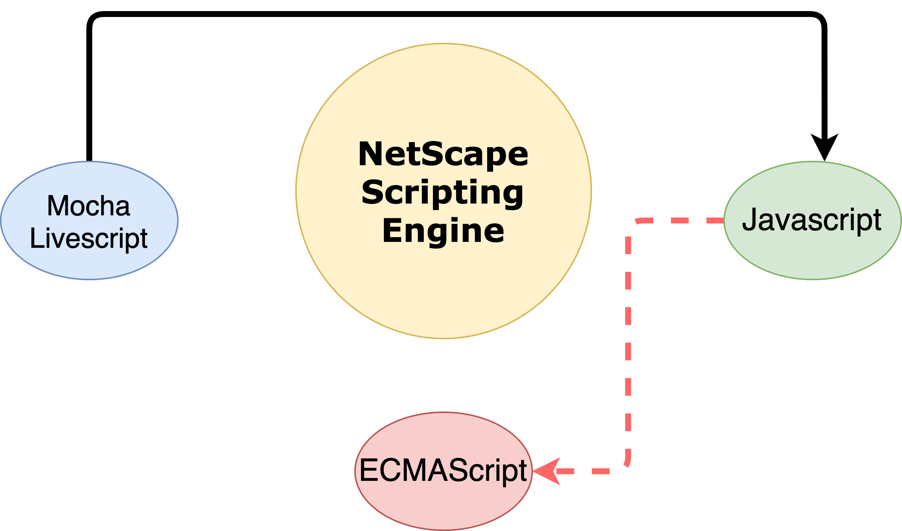

## Network and Web Security

---

### Preamble
1. <em>A system is secure if it behaves precisely in the manner intended -- and does nothing more.</em>; **Ivan Arce** - A renowned vulnerability hunter, circa 2000.
2. <em> A system is secure if and only if it starts in a secure state and cannot enter an insecure state.</em>; **Bella-La Padula** security model - 1960.
3. <em>A system is secure if it adequately protects information that it processes against unauthorized discolusre, unauthorized modification, and unauthorized witholding</em>.
---

### Background
1. The Web has been plagued by a perplexing number, and a remarkable variety of security issues.
2. Security flaws attributed to poor client or server implementations and arbitrary design decisions.
3. Breakdown of the Client-Server Divide; The culprit is **__Javascript__**, a language theat offers the HTTP servers a way to delegate application logic to the browser ("client") side.
---

## Presentation Outline
1. Browser-Side Scripts.
2. Non-HTML Document Types.
3. Content Rendering with Browser Plugins.
4. New and Upcoming Security Features.
---

## Browser-Side Scripts
---

### Browser-Side Scripts

---

### Basic Characteristics of Javascript
1. C-influenced syntax.
2. A straightforward classless object model **??**
3. Automatic garbage collection.
```js
var text = "Hi mom!";
function display_string(str) {
  alert(str);
  return 0;
}
// This will display "Hi mom!". display_str(text);
display_str(text);
```
---

#### Script Processing Model
1. Every HTML document displayed in a browser is given a separate instance of the Javascript execution environment; with an individual namespace for all global variables and functions crated by the loaded scripts.
2. Within a particular execution context, all encountered JavaScript blocks are processed individually and almost always in a well-defined order.
---

#### Parsing
Validates the syntax of the script block.

Example 1:
```js
<script>
var my_variable1 = 1;
var my_variable2 =
</script>

<script>
2;
</script>
```

Example 2:
```js
<script>
var my_variable1 = 1;
var my_variable2 = 2;
</script>
```
---

#### Function Resolution
Example 1:
```js
<script>
hello_world();

function hello_world(){
  alert('Hi mom!');
}
</script>
```

Example 2:
```js
<script>
hello_world();
</script>

<script>
function hello_world(){
  alert('Hi mom!');
}
</script>
```
---

#### Code Execution
```js
<script>
function not_called() {
  return 42;
}

function hello_world() {
  alert("With this program, anything is possible!");
  do_stuff();
}

alert("Welcome to our demo application.");

hello_world();
</script>
```
---

#### Code and Object Inspection Capabilities
1. `eval(...)` function.
```js
eval("alert('Hi mom!')");
```
2. `setTimeout`, `setInterval`, `onClick`, `document.write(...)`

<blockquote>Modification of runtime environment.</blockquote>
---

#### Browser API features
1. _**location**_ object.
2. _**history**_ object.
3. _**screen**_ object.
4. _**navigator**_ object.
5. _**document**_ object.
---

#### Non-HTML Document Types
1. Plaintext files: **_Content-Type: text/plain_**
2. Bitmap Images: JPEG, PNG, GIF, BMP.
3. Audio and Video
4. XML-Based Documents.
```xml
<foo xmlns="http://www.example.com/nonexistent">
<u>Hello</u>
<html xmlns="http://www.w3.org/1999/xhtml">
<u>world!</u>
</html>
</foo>
```
5. Scalar Vector Graphics (SVG).
6. Mathematical Markup Languages.
7. Really Simple Syndication (RSS) and Atom Feeds.
---

### Content Rendering with Browser Plugins
1. Browser plug-ins give the ability to display new file formats in the browser, as if they were HTML.
<blockquote>Browser plug-ins have a long and colorful history of security flaws due to unusual security models devised by plug-in developers.</blockquote>
---

#### Invoking a Plug-in
1. Using `<embed src=...>` or `<object data=...>` markup.
```
<object data="app.swf" type="application/x-shockwave-flash">
<param name="some_param1" value="some_value1">
<param name="some_param2" value="some_value2">
...
</object>
```
2. **_GIFAR_** vulnerability.
```
<object data="http://fuzzybunnies.com/avatars/user11630.jpg"
type="application/x-shockwave-flash">
```
---

#### Document Rendering Helpers
1. A significant portion of plug-in landscape belongs to programs that allow certain very traditional, "nonweb" document formats to be shown directly in the browser.
```
http://example.com/random_document.pdf#foo=javascript:alert(1)
```
---

#### Plug-in-Based Application Frameworks
The aim of some plug-ins is to provide more featured platforms for building interactive web applications.
1. Adobe Flash
2. ActionScript
```
asfunction:getURL,javascript:alert('Hi mom!')
```
3. Sun Java: `<applet>` 
4. ActiveX Controls
```
var sheet = new ActiveXObject("Excel.Sheet"); 
sheet.ActiveSheet.Cells(42,42).Value = "Hi mom!"; 
sheet.SaveAs("c:\\spreadsheet.xls"); 
sheet.Application.Quit();
```
---

## New and Upcoming Security Features
---

#### Cross-Domain Requests
1. W3C introduced _Cross-Origin Resource Sharing (CORS)_ in 2005.
2. CORS relided on HTTP header-level signaling to communicate consent to cross-origin content retrieval using a natural extension of the _XMLHttpRequest_ API.
---

#### CORS Request Types
1. Requests method must be indicated: **GET**, **POST**, **HEAD** etc.
2. Custom headers can be passed.<br/>
  * Cache-Control<br/>
  * Content-Language<br/>
  * Content-Type<br/>
  * Expires<br/>
  * Last-Modified<br/>
  * Pragma
---

#### Security Checks for Simple Requests
Example 1: Sample Request
```
var x = XMLHttpRequest();
x.open('GET', 'http://fuzzybunnies.com/get_message.php?\
id=42', false); 
x.send(null);
```

Response Header
```
GET /get_message.php?id=42 HTTP/1.0
Host: fuzzybunnies.com
Cookie: FUZZYBUNNIES_SESSION_ID=EA7E8167CE8B6AD93D43AC5AA869A920 
Origin: http://www.bunnyoutlet.com
```

Server data response
```
HTTP/1.0 200 OK
Access-Control-Allow-Origin: http://www.bunnyoutlet.com
The secret message is: "It's a cold day for pontooning."
```
---

#### XDomainRequest
1. Microsoft created _**XDomainRequest**_; a counterproposal to **_XMLHttpRequest_**;
```
var x = new XDomainRequest();
x.open("GET", "http://www.fuzzybunnies.com/\
get_data.php?id=1234"); 
x.send();
```
2. Supported in IE8 and above.
---

### Security Model Restriction Framework
---

#### Content Security Policy (CSP)
1. Proposed by Brandon Sterne of Mozilla in 2008.
2. Mitigates the impact of common web vulnerabilities such as Cross-Site Request Forgery (XSRF) to Cross-Site Scripting (XSS).<br/>

Example:
```
X-Content-Security-Policy: default-src 'none'; 
img-src http://*.example.com
```
---

#### Strict Transport Security
One of the most significant weaknesses in the design of HTTPS is that users often begin navigation by typing in a protocol-less URL in the address bar (such as _**bankofamerica.com**_ rather than https://www.bankofamerica.com), in which case the browser will presume HTTP and send the initial request in plaintext.
```
Strict-Transport-Security: max-age=3000000; includeSubDomains
```
---

#### XSS Filtering
Consider a sample url-based XSS, _**`http://www.google.com/search?q=<script>`**_

Mitigation:
```
XSS-Protection: 1; mode=block
```
---

<blockquote><h2>Demo</h2></blockquote>
---


## Conclusion
Developers can leverage the above mentioned mechanisms to secure web-based application and contents.
---

<blockquote><h1>Thank You!</h1></blockquote>
